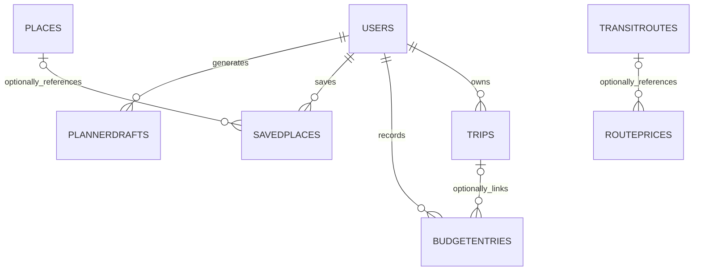

# MongoDB design, version 2

This document supersedes the original 17-collection audit in DATABASE-HARDENING.md. The redesign preserves the existing users and phrasebooks and creates the remaining structure without seeding documents. There are **15 root collections**. Schema definitions for embedded value objects are not separate collections.

## Applied state (2026-09-27)

- Atlas now has all 15 collections with strict/error MongoDB validators and their planned indexes. The 13 new collections remain empty.
- The 12 users and 95 phrasebook records are preserved. One existing budget preference was copied into its owner and verified; the user-approved obsolete `budgetsettings` collection was dropped. `tripstops` is absent.
- The corrected custom role allowed the final migration to succeed. The existing `users` and `phrasebooks` now have database validators as well as Mongoose validation; their four additional indexes are installed.
- `database-preflight.json` records zero data blockers, invalid documents, dangling references or missing indexes across all 15 collections. A separate assertion verified that every installed validator exactly matches its generated schema and uses strict/error enforcement. The before-deployment reports, including `database-before-validator-finalize.json`, retain prior metadata.
- The updated backend responds to health checks. Read-only authenticated GET checks passed for trips, expenses/settings, bookmarks, phrases, planner catalog and both analytics endpoints. These checks did not recreate retired collections or insert fixtures.
- The server TypeScript build, design/security/planner/registration/profile tests, modified client JSX syntax checks and diff whitespace checks passed.

Deployment is complete. The final apply changed validators only; no documents or collections were deleted and no sample records were inserted. The migration skips validators already matching the target rules so reruns avoid unnecessary `collMod` operations. All eight read-only authenticated endpoint checks passed again after the final deployment.

## Collection boundaries

| Collection | Actual feature | Why it is separate / what it embeds |
|---|---|---|
| users | Login, account roles, profiles | Embeds optional `budgetSettings`; exactly one preference object per account |
| phrasebooks | Verified phrase lookup and translation | Existing multilingual phrase records; shared across all travelers |
| trips | Saved travel plans | References owner; embeds the complete bounded itinerary snapshot, including days/stops and planned costs |
| budgetentries | User-recorded expenses | References owner and optionally trip; can grow independently and is queried across trips |
| savedplaces | Personal bookmarks, ratings and notes | References owner and optional catalog place; personal entries can exist without a catalog record |
| places | Shared destination catalog and LGU submissions | Embeds coordinates, structured visit information and moderation state |
| localfoods | Shared local-food knowledge and LGU submissions | Independent records with location and price information; reused by many plans |
| transitroutes | Transit service catalog and LGU submissions | Embeds bounded service/stop-name details; shared by fare records |
| routeprices | Fare records and LGU submissions | Optional transit-route reference; direction, vehicle and fare basis vary independently from a service |
| geofences | Geographic advisory zones and LGU submissions | Embeds geographic and moderation data; independent zone lifecycle |
| pendingregistrations | Email verification before account creation | TTL challenge, password/code hashes hidden by default; never embeds expiry on a permanent user |
| plannerdrafts | Generate, review, enrich and save an itinerary | Owner reference plus typed embedded plan; TTL expiry distinct from permanent saved trips |
| authlimits | Shared authentication rate limits | Atomic counters and TTL buckets; must work across server processes/restarts |
| auditlogs | Managed-account creation and approval decisions | Growing administrative history; should outlive the originating account/resource |
| aisettings | Administrator's global AI switches | Singleton configuration shared across accounts; created only when controls are saved |

No collection exists solely to fill a dashboard. The 13 rebuilt collections start empty. Catalog content must come from real administrator/LGU submissions. Expenses, trips and bookmarks appear only through actual user actions. Operational records are created when their corresponding workflows run.

## Embedding and referencing

The design follows MongoDB's [relationship mapping guidance](https://www.mongodb.com/docs/manual/data-modeling/schema-design-process/map-relationships/): data read together with a bounded, parent-owned lifecycle is embedded; shared or independently growing data is referenced.

- `budgetsettings` is retired. Preferences are `users.budgetSettings`, with `_id: false`. Reading preferences performs no write; an unset preference is returned as `null`, not an assumed budget or savings goal. PUT validates both fields and replaces the value object atomically.
- `tripstops` is retired. The canonical itinerary is `trips.plan.days[].stops[]`; stops are not stored a second time. Plans allow at most seven days and four stops per day. The existing `tripStops`, `stops` and `estimatedCost` API fields are derived views. Saving an itinerary now needs one document write, not a trip plus child inserts.
- `trips.spent` is retired as stored state. Expense totals are aggregated from `budgetentries`, which is the source of truth. Dashboard spending now reads actual expenses rather than an independently mutable trip total.
- Users do not embed unbounded arrays of expenses, bookmarks, trips or audit events. Those are independently paginated collections.
- A saved plan is a historical snapshot. Its destination/fare source IDs record provenance; deleting or editing a catalog record must not rewrite a saved itinerary. Current owner/trip/catalog foreign keys outside snapshots use ObjectId refs and existence validation.
- Catalogs retain separate identities because their forms, moderation, read patterns and lifecycle differ. Combining food, transit and places into an untyped universal collection would weaken validation without improving these queries.



## Keys, validation and indexes

`src/models/_collections.ts` is the explicit registry of physical collection names. Most documents use MongoDB-generated ObjectId `_id` values. Ownership and live relationships also use ObjectId. HTTP IDs are validated 24-character hex strings and serialized as `id` without changing the stored primary key. Embedded preferences and itinerary value objects have `_id: false` because they are addressed through their parent and do not have an independent lifecycle.

Two natural-key exceptions are deliberate: `aisettings._id = 'global'` represents one configuration, and `authlimits._id` is a keyed hash plus time bucket for atomic increments. These values are identifiers, not sample records.

Mongoose enforces required fields, enums, numeric/string bounds, strict scalar input types, bounded arrays and relationship checks. Unknown fields throw (`strict: 'throw'`); `strictQuery: true` is also enabled. Embedded plans are typed schemas rather than unrestricted Mixed blobs. MongoDB validators are generated from the same schemas, supplemented with constraints that Mongoose's exporter omits. Nested objects and array items are closed with `additionalProperties: false`, while explicitly nullable unknown catalog facts remain nullable.

Live ObjectId references are checked in application code with the active transaction session. MongoDB JSON Schema enforces their type but is not a cross-collection foreign-key engine. Historical audit references may outlive a deleted account. Raw database writes and concurrent deletes still require operational care and reference audits.

Indexes support owner/date pagination, unique emails and challenges, the singleton superadmin rule, approval queues, public bookmarks, trip expense totals, catalog ordering and TTL expiry. Existing unique/TTL indexes are preserved. Geographic indexes use a derived GeoJSON Point in longitude/latitude order; no coordinates are guessed from display text. Unknown coordinates remain absent. Creating an empty geospatial collection does not fabricate a map location.

## Empty data and no demo seeding

- No demo accounts, destinations, phrases, trips, fares or expenses are inserted by rebuild.
- Existing 12 users and 95 phrasebook entries are preserved.
- Existing budget preferences are migrated as recorded, without assuming they are accurate or replacing them with a default.
- New accounts no longer receive an assumed Dagupan location. Planning asks for a supported profile location rather than silently choosing one.
- The budget UI shows unset settings explicitly instead of inventing an 8000 PHP budget and 20% savings goal.
- Legacy sample seed entry points are disabled before any database connection. Real account administration and explicit superadmin bootstrap remain available.
- The deterministic planner's existing clearly labeled scheduling/allowance estimates are not imported as verified catalog data. No new placeholder content is introduced by the schema rebuild.

## Rebuild and verify

From `server/`:

```powershell
npm.cmd run db:rebuild -- --dry-run --database=multraverse --out=database-preflight.json
npm.cmd run db:rebuild -- --apply --database=multraverse --out=database-before-rebuild.json
npm.cmd run test:database
npm.cmd run test:hardening
```

The rebuild is not a destructive reset: it never drops collections, deletes records or runs seeds. It creates missing collections, applies strict/error validators and creates missing indexes. Existing data violations or unknown collections block the write phase. The exact target database is required for apply. DDL is not transactional; preserve the before report and rerun after correcting a failed operation. Never replace users/phrasebooks just to work around missing permissions.

For an account that can create collections but lacks `collMod`, `--create-missing-only` provisions missing collections with validators/indexes and leaves existing collections unchanged. This is explicitly **partial deployment**, not completed validation of existing data. Grant `collMod` on the target database and rerun the full apply command to finish. The server refuses to start when expected collections are absent and warns when an existing collection has no database validator.

`scripts/migrate-budget-preferences.cjs` is the separately reviewed legacy migration. It checks all owners and values, refuses conflicts, copies only the preference fields, verifies every copy, and drops only `budgetsettings` when explicitly run with `--apply --drop-legacy`. The user approved this operation; one record was copied and verified before its collection was removed. An older local backend that recreated the collection was stopped.

## Verification scope

The design tests run entirely in memory and do not insert fixtures into Atlas. They verify the 15-model registry, no standalone budget-settings/stop model, no implicit budget/location, nested type and array limits, derived trip fields, and actual budget-route GET/PUT behavior. Existing planner, registration, profile and injection tests are retained. Atlas preflight checks real documents against the generated schemas without modifying them. Live collection counts, validator presence and index drift are recorded in the final preflight report.
